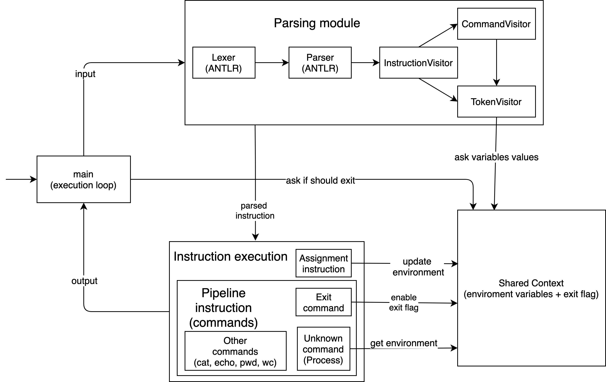

## Запуск

`./gradlew launch --console=plain`

## Архитектура и детали реализации

#### Общее

В функции `main` инструкции обрабатываются по циклу. Каждая инструкция от пользователя проходит через модуль парсинга, а затем исполняется, результат команды выводится. Все части проекта имеют доступ к общему контексту `Context`, в котором хранятся environment variables и exit flag.

#### Парсинг

Когда пользователь вводит очередную инструкция, она передаётся в модуль парсинга, построенный на основе библиотеки `ANTLR`. Во время сборки проекта по грамматике генерируются лексер, парсер и абстрактные визиторы. 

`InstructionVisitor` и `CommandVisitor` создают инструкции и команды, используя для этого контекст парсера.

`TokenVisitor` отвечает за подстановку значений переменных, это делается с помощью регекспов, значения берутся из `Context`.

Функция `InstructionParser.parseInstruction` принимает на вход команду пользователя, применяет к ней лексер, парсер, а затем `InstructionVisitor`. На выходе получаем распаршеный `TopLevelInstruction`.

#### Инструкции и команды

У `TopLevelInstruction` есть два наследника — `AssignmentInstruction` и `PipelineInstruction`. 

`AssignmentInstruction` обновляет значении environment variable в `Context`.

`PipelineInstruction` последовательно запускает `Command`, из которых эта инструкция состоит. Каждый `Command` принимает на вход результат предыдущей команды и возвращает новый результат. Результат последней `Command` является результатом `PipelineInstruction`.

Все команды создаются с помощью фабрики `CommandFactory`.

`UnknownCommand` запускает новый процесс, используя `ProcessBuilder`. Перед запуском все environment variables из `Context` передаются процессу.

`ExitCommand` выставляет в true exit flag в `Context`. `main` после выполнения каждой инструкции проверяет, выставлен ли этот флаг, если да, то завершается.

При вызове остальных команд взаимодействия с другими частями программы не происходит. 

#### Схема

#### Выбор библиотеки для grep

Были рассмотрены следующие библиотеки: `Apache Commons CLI`, `Argparse4j`, `jargs` и `JCommander`.

* `Apache Commons CLI`
    * На builder-ах, что в простой ситуации, как у нас, даёт бессмысленное усложнение кода
    * Самая известная, но нет репозитория на гитхабе
    * Документация плохая, кроме джавадоков есть только одна страница с примером использования

* `Argparse4j`
    * На builder-ах
    * Есть несколько уникальных фич, но в нашем случае они не нужны
    * Не очень активное коммьюнити

* `jargs`
    * Нет документации, кроме тестов и джавадоков
    * Всё очень старое, последний содержательный коммит в 2012, сейчас не поддерживается

* `JCommander`
    * На аннотациях, что позволяет более лаконичный и понятный код
    * Есть хорошая документация
    * Активное коммьюнити (1400 звёзд, 300 issues, 150 PR)
    
В итоге было решено выбрать `JCommander`.